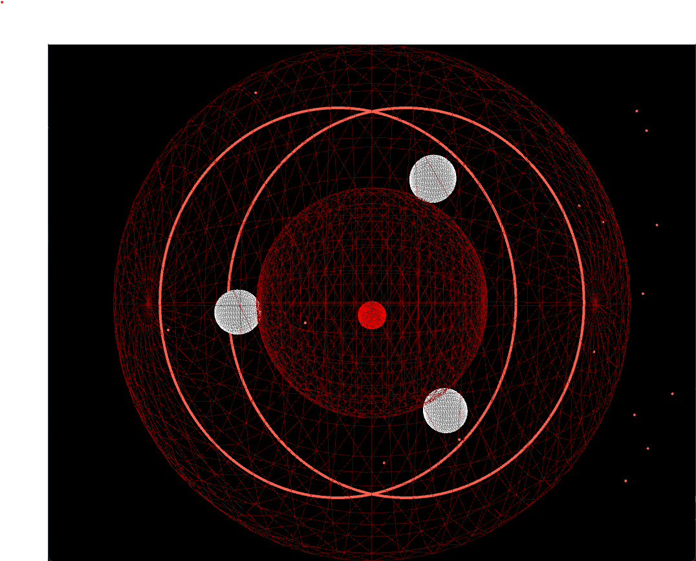

# Music Visualiser Project

Student Number: C21416022 (Bakht Zia Khan), C21716601 (Emil Roy), C21388736 (Nicolas Ruth)


# Description of the assignment
Assignment Brief: In this creative coding team project, you will work in a team of up to four, to create an abstract visual story of a song. You will use Processing, Minim or the Processing Sound library to create audio responsive elements and Github to manage your project. You will create a program that responds to the audio of a chosen song and generates a visually compelling and abstract representation of the song's mood, tempo, and structure. The program should showcase your teamwork, creativity, technical skills, and ability to effectively communicate emotions and narrative through visual elements.


# Instructions
Press F5 to see the Music Visual.
Press Space to start the Visual and press the numbers 1 to 5 to change visuals.


# How it works
We use the 

# What we are most proud of in the assignment
We are proud in our team's accomplishment of completing this music visual project. At the start of the project, we thoroughly analyzed the assignment brief, dissecting it into manageable tasks that we could individually work on. Our team collaborated proficiently, regularly discussing our progress, brainstorming ideas, and offering constructive feedback to one another. Diligently utilizing our technical skills in Processing, Minim, and Github, we created an audio-responsive program that effectively conveyed our chosen song's mood, tempo, and structure. We experimented with various visual elements, refined our code, and iterated on our design until we produced five visually stimulating and abstract representation of the song, showcasing our creativity and storytelling capabilities. This project allowed us to sharpen our teamwork, creativity, and technical skills, and we are proud of the program we produced as a team.


# Code

This is the code we used to switch between the visuals. We decided to use a switch statement as we believe it is efficient and simple to code.

```Java
  switch(v)
        {
            case 1:
            {
                bakht.render();
                break;
            }

            case 2:
            {

                er.render();
                er1.render();

                break;
            }

            case 3:
            {
                
                nico.render();
                break;
            }

            case 4:
            {
            
                visual6.render();

                break;
            }

            case 5:
            {

                us1.render();
                us.render();

                break;
            }


        }
```


# Images
Case 1:


Case 2:


Case 3:

Case 4:

Case 5:



# Youtube Video:

[](https://www.youtube.com/watch?v=J2kHSSFA4NU)

